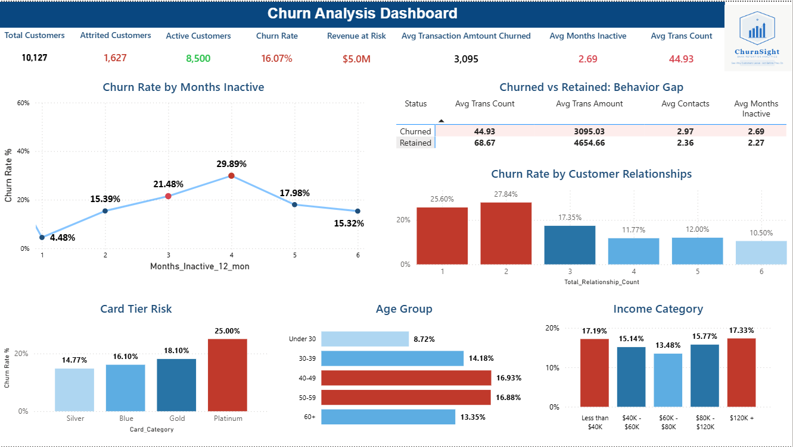

# Bank Customer Churn Analysis Dashboard
 
> An end-to-end churn analysis project built for the Churn Customer Analysis Manager to identify at-risk customers and drive retention strategies.
 


 
---
 
## Table of Contents
 
1. [Project Purpose](#project-purpose)
2. [About the Data](#about-the-data)
3. [Tools Used](#tools-used)
4. [Target Audience & Role](#target-audience--role)
5. [Business Problem](#business-problem)
6. [Dashboard Explanation](#dashboard-explanation)
7. [Key Insights](#key-insights)
8. [Project Files](#project-files)
---
 
## Project Purpose
 
The purpose of this project is to analyze customer churn behavior in a credit card service and provide the **Churn Customer Analysis Manager** with actionable insights to:
 
- Identify why customers are leaving the bank
- Detect which segments are at highest risk
- Quantify the financial impact of customer attrition
- Recommend data-driven retention strategies
This dashboard transforms raw banking data into a clear, visual story that supports strategic decision-making at the executive level.
 
---
 
## About the Data
 
**Dataset Source:** [Credit Card Customers - Kaggle](https://www.kaggle.com/datasets/sakshigoyal7/credit-card-customers)
**Total Customers:** 10,127
**Total Features:** 21 columns
**Time Period:** 12 months of customer activity
 
### Column Descriptions:
 
| Column Name | Description |
|:-|:-|
| `CLIENTNUM` | Unique customer identifier |
| `Attrition_Flag` | Target variable — "Existing Customer" or "Attrited Customer" |
| `Customer_Age` | Age of the customer in years |
| `Gender` | Customer gender (M / F) |
| `Dependent_count` | Number of dependents the customer has |
| `Education_Level` | Educational background (High School, Graduate, Doctorate, etc.) |
| `Marital_Status` | Marital status (Single, Married, Divorced, Unknown) |
| `Income_Category` | Annual income range ($40K, $40-60K, $60-80K, $80-120K, $120K+) |
| `Card_Category` | Type of credit card (Blue, Silver, Gold, Platinum) |
| `Months_on_book` | Number of months the customer has been with the bank |
| `Total_Relationship_Count` | Total number of bank products/services the customer holds |
| `Months_Inactive_12_mon` | Number of inactive months in the last 12 months |
| `Contacts_Count_12_mon` | Number of times customer contacted the bank in 12 months |
| `Credit_Limit` | Credit limit on the customer's credit card |
| `Total_Revolving_Bal` | Total revolving balance on the credit card |
| `Avg_Open_To_Buy` | Average available credit (Credit Limit - Revolving Balance) |
| `Total_Amt_Chng_Q4_Q1` | Ratio of transaction amount in Q4 vs Q1 |
| `Total_Trans_Amt` | Total transaction amount over 12 months |
| `Total_Trans_Ct` | Total number of transactions over 12 months |
| `Total_Ct_Chng_Q4_Q1` | Ratio of transaction count in Q4 vs Q1 |
| `Avg_Utilization_Ratio` | Average credit card utilization ratio |
 
### Data Distribution:
 
```
Total Customers:    10,127
Existing Customers:  8,500 (83.93%)
Attrited Customers:  1,627 (16.07%)
```
 
---
 
## Tools Used
 
| Tool | Purpose |
|:-|:-|
| **SQL (MySQL)** | Data exploration, cleaning, and statistical queries |
| **Python (Pandas, NumPy)** | Initial data exploration and validation |
| **Google Colab** | Python notebook environment |
| **Power BI Desktop** | Dashboard development and visualization |
| **DAX** | Custom measures and calculated columns |
 
### Why Power BI?
 
This is my first project using Power BI, building on my previous experience with Tableau. Power BI was chosen for its strong DAX capabilities and seamless SQL integration.
 
---
 
## Target Audience & Role
 
### Primary Audience:
**Churn Customer Analysis Manager** — responsible for monitoring customer attrition, identifying at-risk segments, and implementing retention strategies.
 
### My Role:
**Data Analyst** — responsible for:
- Cleaning and exploring the dataset (SQL + Python)
- Identifying patterns and behavioral drivers of churn
- Building an executive dashboard in Power BI
- Translating data findings into actionable business recommendations
---
 
## Business Problem
 
The bank is experiencing customer attrition at a rate of **16.07%**, leading to significant revenue loss. The Churn Customer Analysis Manager needs to answer five critical questions:
 
| # | Question | Why It Matters |
|:-:|:-|:-|
| 1 | **Who** is leaving? | To target the right customer segments |
| 2 | **When** are they leaving? | To define the intervention window |
| 3 | **Why** are they leaving? | To address root causes |
| 4 | **How much** are we losing? | To prioritize budget allocation |
| 5 | **How** can we prevent it? | To build effective retention strategies |
 
### Financial Impact:
- **Annual Revenue at Risk:** $5.04M
- **% of Total Transaction Volume Lost:** 11.29%
---
 
## Dashboard Explanation
 

 
### Dashboard Structure (4-Layer Story):
 
The dashboard is designed to answer business questions in a logical sequence, telling a complete story in under 90 seconds.
 
#### Layer 1: Executive KPIs (Top Row)
**Purpose:** Give the manager the big picture in 5 seconds
 
- **Total Customers:** 10,127 (overall portfolio size)
- **Attrited Customers:** 1,627 (already lost)
- **Active Customers:** 8,500 (currently retained)
- **Churn Rate:** 16.07% (the headline number)
- **Revenue at Risk:** $5.0M (financial impact)
- **Avg Transaction Amount Churned:** $3,095
- **Avg Months Inactive:** 2.69
- **Avg Trans Count:** 44.93
#### Layer 2: Timeline & Behavior Analysis (Middle Row)
**Purpose:** Show when and how customers behave before leaving
 
- **Churn Rate by Months Inactive:** Line chart showing when customers are most likely to leave
- **Churned vs Retained: Behavior Gap:** Table comparing key metrics between the two groups
#### Layer 3: Customer Engagement
**Purpose:** Show why customers leave based on their engagement level
 
- **Churn Rate by Customer Relationships:** Bar chart showing how many bank services a customer has and its impact on churn
#### Layer 4: Demographics Segmentation (Bottom Row)
**Purpose:** Identify who is at highest risk
 
- **Card Tier Risk:** Donut chart showing which card categories churn most
- **Age Group:** Horizontal bar chart showing age-based risk patterns
- **Income Category:** Column chart showing income-based risk patterns
---
 
## Key Insights
 
### Insight #1: Inactivity is a Strong Churn Predictor
 
| Months Inactive | Churn Rate |
|:-:|:-:|
| 1 month | 4.48% |
| 2 months | 15.39% |
| 3 months | 21.48% |
| **4 months** | **29.89%** |
| 5 months | 17.98% |
| 6 months | 15.32% |
 
> **Finding:** Customers with **4 months of inactivity** show the highest churn rate (29.89%). This creates a clear early warning window for proactive retention.
 
---
 
### Insight #2: More Relationships = Higher Retention
 
| Number of Relationships | Churn Rate |
|:-:|:-:|
| 1 relationship | 25.60% |
| 2 relationships | 27.84% |
| 3 relationships | 17.35% |
| 4 relationships | 11.77% |
| 5 relationships | 12.00% |
| 6 relationships | 10.50% |
 
> **Finding:** Customers with 1-2 banking relationships are **2.6x more likely to churn** than customers with 6 relationships.
 
---
 
### Insight #3: The VIP Paradox
 
| Card Tier | Churn Rate |
|:-|:-:|
| **Platinum** | **25.00%** |
| Gold | 18.10% |
| Blue | 16.10% |
| Silver | 14.77% |
 
> **Finding:** The most valuable customer segment (Platinum) has the highest churn rate — a counter-intuitive but critical finding.
 
---
 
### Insight #4: Peak Risk Age Group (40-59)
 
| Age Group | Churn Rate |
|:-|:-:|
| Under 30 | 8.72% |
| 30-39 | 14.18% |
| **40-49** | **16.93%** |
| **50-59** | **16.88%** |
| 60+ | 13.35% |
 
> **Finding:** The 40-59 age group is most at-risk — these customers are in their peak financial years with complex banking needs.
 
---
 
### Insight #5: Income Risk Pattern (U-Shape)
 
| Income Category | Churn Rate |
|:-|:-:|
| **Less than $40K** | **17.19%** |
| $40K - $60K | 15.14% |
| $60K - $80K | 13.48% |
| $80K - $120K | 15.77% |
| **$120K+** | **17.33%** |
 
> **Finding:** Both the lowest and highest income segments show the highest churn — a U-shape pattern with different drivers for each end.
 
---
 
### Insight #6: Behavioral Gap (Churned vs Retained)
 
| Metric | Churned | Retained | Gap |
|:-|:-:|:-:|:-:|
| Avg Transaction Count | 44.93 | 68.67 | **-35%** |
| Avg Transaction Amount | $3,095 | $4,655 | **-33%** |
| Avg Contacts (12 mo) | 2.97 | 2.36 | **+26%** |
| Avg Months Inactive | 2.69 | 2.27 | **+18%** |
 
> **Behavioral Profile of Churners:** Lower activity, lower spending, more bank contacts (complaints?), and more inactive months.
 
---
 
## Project Files
 
| File | Description |
|:-|:-|
| `Dashbord_ChurnCustomer.pbix` | Main Power BI dashboard file |
| `dashboard_preview.png` | Dashboard screenshot |
| `BankChurners.csv` | Original dataset (10,127 customers) |
| `BankChurners_DC.csv` | Cleaned dataset (after data cleaning) |
| `SQL.txt` | All SQL queries used in analysis |
| `CreditCardCustomers.ipynb` | Python notebook for data exploration |
| `README.md` | Project documentation |
 
---
 
## Contact
 
- **GitHub:** [@AlaaZoubi2001](https://github.com/AlaaZoubi2001)
- **LinkedIn:** [Your Profile](https://linkedin.com/in/your-profile)
